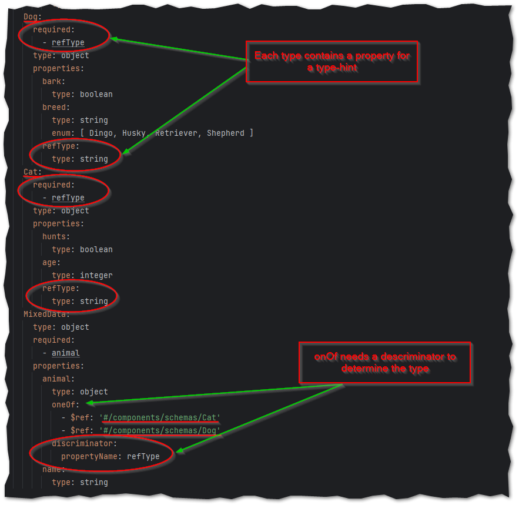

# open-api-playground

Playground for open-api.


This example uses [petstore.yml](src/main/resources/petstore.yml) to generate stubs for model-classes and controller.
It contains a solution for ``onOf`` usage.

run command to generate code
````shell
mvn clean install
````

# onOf example


## Links
* [Swagger UI](http://localhost:8080/swagger-ui/index.html#/pets/patchPet)

## Sources

* Generator
  * [Documentation for the spring Generator | OpenAPI Generator](https://openapi-generator.tech/docs/generators/spring/)
  * [Open API Server Implementation Using OpenAPI Generator | Baeldung](https://www.baeldung.com/java-openapi-generator-server)
  * [OpenAPITools/openapi-generator: OpenAPI Generator allows generation of API client libraries (SDK generation), server stubs, documentation and configuration automatically given an OpenAPI Spec (v2, v3)](https://github.com/OpenAPITools/openapi-generator)
    * [openapi-generator/modules/openapi-generator-maven-plugin at master · OpenAPITools/openapi-generator](https://github.com/OpenAPITools/openapi-generator/tree/master/modules/openapi-generator-maven-plugin)
* Banner
  * [Create ASCII text banners online](https://manytools.org/hacker-tools/ascii-banner/)
* Problems with onOf etc
  * [[Java] Swagger oneOf type: Jackson trying to instantiate interface instead of implementation? · Issue #10011 · swagger-api/swagger-codegen](https://github.com/swagger-api/swagger-codegen/issues/10011)
  * [[BUG][SPRING] oneOf type: Jackson trying to instantiate interface instead of implementation · Issue #15082 · OpenAPITools/openapi-generator](https://github.com/OpenAPITools/openapi-generator/issues/15082)
* Spring Doc
  * [OpenAPI 3 Library for spring-boot](https://springdoc.org/)


## Request-Payloads for patch

### Cat
json-payload for a cat:
````json
{
  "animal": {
    "refType": "Cat",
    "hunts": true,
    "age": 2
  },
  "name": "Jerry"
}
````
curl command for a cat:
````shell
curl -X 'PATCH' \
  'http://localhost:8080/pets' \
  -H 'accept: */*' \
  -H 'Content-Type: application/json' \
  -d '{
  "animal": {
    "refType": "Cat",
    "hunts": true,
    "age": 2
  },
  "name": "Jerry"
}'
````

### Dog

json-payload for a dog:
````json
{
  "animal": {
    "bark": true,
    "breed": "Dingo",
    "refType": "Dog"
  },
  "name": "Hasso"
}
````
curl command for a dog:
````shell
curl -X 'PATCH' \
  'http://localhost:8080/pets' \
  -H 'accept: */*' \
  -H 'Content-Type: application/json' \
  -d '{
  "animal": {
    "bark": true,
    "breed": "Dingo",
    "refType": "Dog"
  },
  "name": "Hasso"
}'
````
